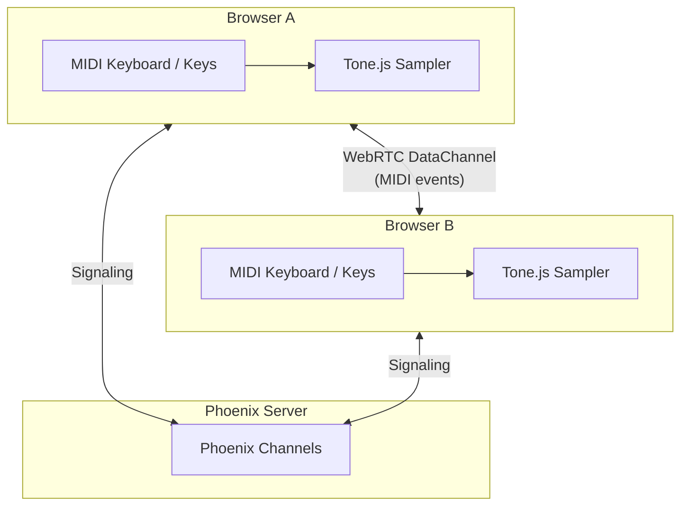

# Live Piano

Live Piano allows your friends to hear you play the piano in real-time, or even play along with you!

**Try it live:** [piano.dimamik.com](https://piano.dimamik.com)

## How it works?



### Key Components

**Backend (Elixir/Phoenix)**

- **Phoenix LiveView** - Renders the piano UI and manages room state
- **Phoenix Channels** - WebSocket-based signaling for WebRTC peer discovery and connection establishment
- **Phoenix Presence** - Tracks connected users in each room

**Frontend (JavaScript)**

- **Tone.js** - Audio synthesis library using the Salamander Grand Piano samples
- **Web MIDI API** - Captures input from hardware MIDI keyboards
- **WebRTC DataChannels** - Peer-to-peer transmission of MIDI events with minimal latency

### Data Flow

1. **Input Capture**

   - Hardware MIDI keyboard via Web MIDI API (note on/off, velocity, sustain pedal)
   - On-screen piano keys via mouse/touch events
   - Computer keyboard mapping (A-L for white keys, W-E-T-Y-U for black keys)

2. **Local Playback**

   - MIDI events trigger Tone.js Sampler immediately for zero-latency local feedback
   - Samples are preloaded on page load for instant response

3. **P2P Broadcast**

   - MIDI events use compact binary format: `[type, note, velocity]` (3 bytes)
   - Type byte: `0x00`=off, `0x01`=on, `0x02`=sustain
   - Sent via WebRTC DataChannels to all connected peers
   - DataChannels use `ordered: false, maxRetransmits: 0` for lowest latency

4. **Remote Playback**
   - Receiving browsers deserialize MIDI events
   - Trigger local Tone.js Sampler for audio synthesis
   - Visual keyboard highlights sync with remote notes

### WebRTC Signaling

The server only handles signaling - no MIDI data flows through it:

1. User A joins room → Phoenix assigns unique peer ID
2. User B joins room → Server broadcasts `peer_joined` to User A
3. User A creates RTCPeerConnection and sends `offer` via Channel
4. Server relays `offer` to User B
5. User B creates answer and sends via Channel
6. ICE candidates exchanged until connection established
7. DataChannel opens → Direct P2P MIDI streaming begins

### Audio Synthesis

- **Sample Library**: Salamander Grand Piano (24 velocity layers, ~25MB)
- **Sample Format**: MP3, loaded from tonejs.github.io CDN
- **Preloading**: Samples begin loading on page mount (before user interaction)
- **AudioContext**: Started on first user interaction (browser requirement)
- **Sustain Pedal**: Implemented via note tracking - held notes sustain until pedal release

### Full 88-Key Piano

- Note range: A0 (MIDI 21) to C8 (MIDI 108)
- Horizontally scrollable with auto-center on middle C (C4)
- Responsive sizing for mobile devices

### Browser Compatibility

- **Chrome/Edge**: Full support including Web MIDI
- **Firefox**: Works but no Web MIDI API (on-screen/computer keyboard only)
- **Safari**: Requires TURN servers for WebRTC on mobile networks

## Development

```bash
# Install dependencies
mix deps.get
cd assets && npm install && cd ..

# Start server
mix phx.server

# Run tests
mix test

# Run all checks
mix precommit
```
